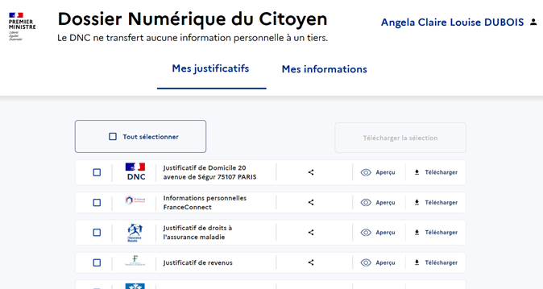

# Le Dossier Numérique du Citoyen : les justificatifs à portée de mains des usagers

## Qu’est-ce que le DNC ?
L’idée d’un dossier Numérique du Citoyen est issue d’un constat : celui de la difficulté pour les usagers de s’approprier les données et justificatifs que l’administration possèdent sur eux, ce qui complexifie les démarches de la vie quotidienne auprès des acteurs publics et privés.

Le projet Dossier numérique du Citoyen (DNC) vise à créer un espace permettant aux citoyens d’avoir une visibilité sur l’ensemble de leurs données personnelles et leurs justificatifs détenus par les différentes administrations et de les rendre disponibles pour simplifier leurs démarches administratives.

## Comment s’inscrit le DNC dans l’écosystème public ?
Le dossier numérique du citoyen s’inscrit dans la lignée du programme « Dites-le-nous qu’une fois » et dans la logique d’APIsation des services publics. En effet, le Dossier Numérique du Citoyen va s’appuyer en priorité sur l’écosystème de services déjà existants (France Connect, Démarches Simplifiées, API particulier) pour sa mise en œuvre. Qui plus est, le DNC n’étant pas un espace de stockage, il sera connecté par API aux fournisseurs de données (DGFIP, CNAM, CAF, etc…).

## A quoi sert le DNC ?
Le DNC permettra à chaque citoyen :
* D'accéder à l’ensemble de ses données,
* de signaler une erreur,
* De générer automatiquement les justificatifs les plus utilisés. 

## Où trouve-t-on le DNC ?
En tant que site internet, accessible avec son compte France Connect ou depuis un bouton « mes justificatifs » intégrable à tout formulaire ou site désireux de faciliter la démarche d’un usager.

## Comment le DNC gère les données personnelles ?
Le DNC **n’est pas** un coffre-fort de documents. Il n’a pas vocation à stocker des documents. Il a vocation à afficher les données et documents qui vont être « appelées » lors de la connexion avec France connect auprès des fournisseurs de données partenaires. Le seul stockage concernera les documents produits et ce sur une période très courte (quelques minutes) ainsi que des identifiants selon le souhait de l'usager. Le DNC est construit dans le respect de la réglementation RGPD en vigueur dans le but de protéger le traitement des données des citoyens.

## Quelles sont les grandes fonctions proposées ?

### 1. La connexion au DNC. 
La connexion au DNC se fait via France Connect. 

### 2. « Mes informations »
L’écran « Mes informations » est composée de « cartouches d’informations » recensant un choix d’informations remonté par l’API du fournisseur de données. 
5 fournisseurs de données sont aujourd’hui listés : France connect (dont les données proviennent exclusivement de l’INSEE et du fournisseur d’identité utilisé par l’usager lors de sa connexion), la DGFIP (API impôt particulier), la CAF, pôle emploi, le statut étudiant (API particulier), la CNAM (API CNAM). En appelant les API, le DNC peut recenser plus d’informations que celles qui sont affichées dans les cartouches. La fonctionnalité « Voir plus » permet d'afficher l’ensemble des données remontées. La fonctionnalité « signaler une erreur » permet d’accéder facilement à la procédure de signalement d’erreur prévue par le fournisseur de données.  

### 3. « Mes justificatifs »
La page « Mes justificatifs » est le cœur du service proposé par le DNC : le recensement, via API, de documents reconstitués. 
L'usager peut consulter un justificatif dont le contenu est généré automatiquement à sa connexion avec des informations remontées par les API (justificatif de domicile, attestation de droit, attestation de quotient familial...).

Il est alors possible pour lui de télécharger le document, mais celui-ci n'est pas stocké à l'issue de la connexion. Seuls un identifiant de justificatif, une clé de chiffrement dédiée, la date de création et la date de fin de validité du document sont enregistrés, cela afin de prouver l’authentification a posteriori d’un document généré par le DNC. 

Les documents reconstitués et générés par le DNC disposent d'un QR Code permettant de vérifier l’authenticité des données affichées sur le document. 
Plus d'informations sur le fonctionnement du QR Code sont disponibles [ici](Fonctionnement_QRCode.md). 

### 4. La page d’aide
La page d’aide recense l'ensemble des questions que l'usager pourrait se poser sous la forme d'une FAQ.

### 5. L'intégration du DNC
Le DNC s'intègre simplement en ajoutant un lien ou un bouton ouvrant le DNC dans un nouvel onglet ou une nouvelle fenêtre du navigateur.
L'utilisateur peut alors accéder rapidement aux justificatifs connus de l'administration, les télécharger et les réutiliser dans ses démarches. Il peut aussi paramétrer un bouton permettant de pré-sélectionner certains justificatifs.

