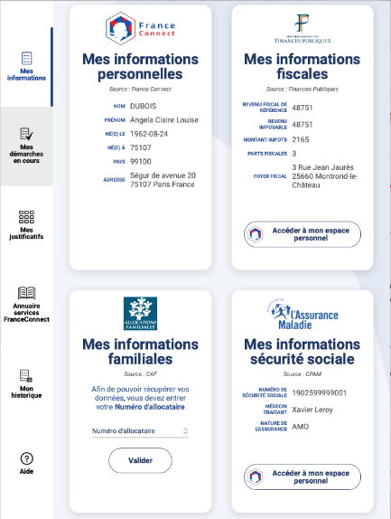
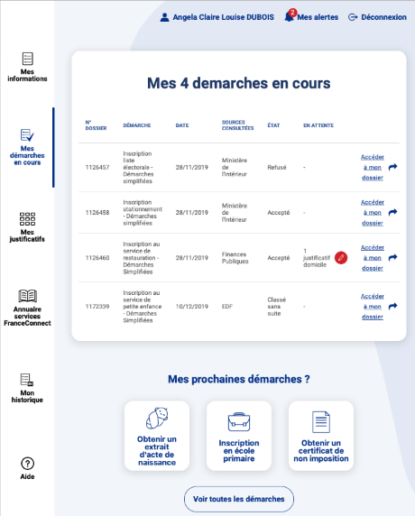
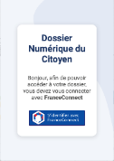

# Le Dossier Numérique du Citoyen : les justificatifs à portée de mains des usagers

## Qu’est-ce que le DNC ?
L’idée d’un dossier Numérique du Citoyen est issue d’un constat : celui de la difficulté pour les usagers de s’approprier les données et justificatifs que l’administration possèdent sur eux, ce qui complexifie les démarches de la vie quotidienne auprès des acteurs publics et privés.

Le projet Dossier numérique du Citoyen (DNC) vise à créer un espace permettant aux citoyens d’avoir une visibilité sur l’ensemble de leurs données personnelles, ses justificatifs détenues par les différentes administrations publiques et de les rendre disponibles pour simplifier leurs démarches administratives, mais aussi disposer d’un tableau de bord des démarches engagées auprès des administrations, et de l’état d’avancement de ses dossiers.

## Comment s’inscrit le DNC dans l’écosystème public ?
Le dossier numérique du citoyen s’inscrit dans la lignée du programme « Dites-le-nous qu’une fois » et dans la logique d’APIsation des services publics. En effet, le Dossier Numérique du Citoyen va s’appuyer en priorité sur l’écosystème de services déjà existants (France Connect, Démarches Simplifiées, API particulier) pour sa mise en œuvre. Qui plus est, le DNC n’étant pas un espace de stockage, il sera connecté par API aux fournisseurs de données (DGFIP, DASS etc…) qui transmettront les données des utilisateurs sur la plateforme DNC.

## A quoi sert le DNC ?
Le DNC permettra à chaque citoyen :
* D'accéder à l’ensemble de ses données et justificatifs, 
* De suivre l’avancement des démarches en cours effectuées auprès des administrations partenaires,
* D'éditer des justificatifs personnalisés (ensemble des données sélectionnées résumées sur un document PDF, téléchargeable via le DNC).

## Où trouve-t-on le DNC ?
Il sera accessible de deux manières : 
* En tant que site internet, directement à partir de son compte France Connect
* En « plateforme intégrable » à tous les sites de fournisseurs de services

## Comment le DNC gère les données personnelles ?
Le DNC **n’est pas** un coffre-fort de documents. Il n’a pas vocation à stocker des documents. Il a vocation à afficher les données et documents qui vont être « appelées » lors de la connexion avec France connect auprès des forunisseurs de données qui sont partenaires. Le seul stockage concernera les documents produits et ce sur une période très courte. Le DNC est construit dans le respect de la réglementation RGPD en vigueur dans le but de protéger le traitement des données des citoyens.

## Quels sont les grandes fonctions proposées ?

### 1. La connexion au DNC. 
La connexion au DNC se fait via France Connect. Aucun autre moyen d’identification ne sera proposé. 
La procédure de connexion au DNC est dépendante du service France Connect : un écran listant les moyens de connexion, un écran d’authentification, un écran de consentement, et un écran de résumé du profil.  

### 2. L’affichage de « mes informations »
L’écran « mes informations » est composée de « cartouches d’informations » recensant un choix d’informations remontée par l’API du fournisseur de données. 
5 fournisseurs de données sont aujourd’hui listés : France connect (dont les données proviennent exclusivement de l’INSEE et du fournisseuer d’identité utilisé par l’usager lors de sa connexion), la DGFIP (API particulier et API impôt particulier), la CAF (API particulier), la CNAM (API CNAM), Pôle Emploi (API Pôle Emploi). En appelant les API, le DNC recense plus de d’informations que celles qui sont affichées. Une fonctionnalité « voir plus » est à l’étude pour afficher l’ensemble des données remontées. 
### 3. L’affichage de « mes démarches en cours »
L’écran « mes démarches en cours » propose deux services : 
- Une liste des démarches en cours recensées auprès des services publics partenaires : un lien cliquable donne l’accès au dossier sur le site du fournisseur de service. 
- Une liste des états d’avancement des dossiers déposés auprès des services publics partenaires. Ces « états » seront exposés à l’usager dans son tableau de bord des démarches en cours, et il pourra alors accéder via un lien cliquable au contenu de son dossier sur le site du fournisseur de services.

### 4. L’affichage de « mes justificatifs »
La page « mes justificatifs » est le cœur du service proposé par le DNC : le recensement, via API, des documents originaux et/ou reconstitués. 
- Les documents originaux : les documents sont appelés par API à la demande de l’usager dans son DNC. Il s’agit du document le plus à jour fourni par l’administration. Dès la déconnexion de la plateforme, ces documents sont supprimés du DNC.
- Les documents générés sont issus des informations remontées par les API de données. Le document généré n’est pas stocké. Seules un descriptif identité et la date de création du document sont enregistrée, cela afin de prouver l’authentification a posteriori d’un document généré par le DNC. 

### 5. L’affichage de l’annuaire des services France Connect
L’annuaire des services France Connect est une page gérée par France Connect et intégrée à la plateforme DNC. Le design, le comportement de la page et son contenu sont gérés par France Connect.
### 6. L’affichage de l’historique
Il s’agit de l’historique d’uitilisation de son compte France Connect. Il recense les connexions et usages de son compte personnel France Connect. Le design, le comportement de la page et son contenu sont gérés par France Connect.
### 7. L’affichage de la page d’aide
La page d’aide n’est pas encore développée sur la plateforme DNC.
### 8. Les alertes
Les alertes sur la plateforme DNC sont les notifications de l’écran « mes démarches en cours ». le comportement du bouton « Mes alertes » dépend de l’écran « mes démarches en cours » (3).
### 9. Le profil individuel
La page « profil individuel » n’est pas encore développée sur la plateforme DNC. Il premttra à l’usager de sélectionner un certains nombre de comportament attendus de l’outil.
### 10. La fonctionnalité « plateforme intégrée »
La plateforme intégrée, dite « embedded » est une fonctionnalité du DNC permet d’accéder à son DNC  à partir du site d’un fournisseur de service. Lors de la démarche, un bouton « DNC » permet, grâce à une connexion à France Connect, d’appeler les API concernées par les informations nécessaires à la démarche et d’afficher des données demandées et déjà connues par l’administration. La fonctionnalité permet de télécharger un PDF contenant toutes les informations requises ou de pré-remplir les champs associés dans le site du fournisseur de service.

### DNC en mode portail autonome
Le DNC en tant que « portail autonome », permettant une vision 360° des données personnelles, justificatifs et démarches en cours.

 
### DNC en mode intégré
Le DNC « intégré » directement sur le site d’un fournisseur de service.

