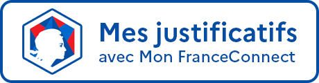

# Devenir partenaire de Mon FranceConnect
## 1.	URLs de Mon FranceConnect

 - URL de la plateforme : [https://mon.franceconnect.gouv.fr](https://mon.franceconnect.gouv.fr)
 - URL complète à intégrer (bouton ou lien) : [https://mon.franceconnect.gouv.fr/Redirect](https://mon.franceconnect.gouv.fr/Redirect)
 - URL de test des boutons : [https://mon.franceconnect.gouv.fr/test-button](https://mon.franceconnect.gouv.fr/test-button)

## 2.	En tant que fournisseur de service

Dans le cadre d'une démarche ou d'un formulaire nécessitant des pièces justificatives du citoyen, sur votre formulaire, vous pouvez simplement ajouter un lien vers Mon FranceConnect ou intégrer un des boutons ci-dessous.

L'équipe Mon FranceConnect met à disposition 2 types de boutons :

 - Un bouton **générique** : l’usager se connecte simplement à Mon FranceConnect
 - Un bouton de **présélection** d’un ou plusieurs justificatifs : l'usager arrive sur une liste présélectionnée de justificatifs qu'il peut simplement télécharger. 
 
 

Peu importe le mode d'implémentation choisi, nous vous invitons à paramétrer l'URL de Mon FranceConnect afin de facilement mettre à jour votre plateforme.

### 2.1.	Bouton générique
Le bouton générique permet à l’usager de se connecter simplement à Mon FranceConnect.
Ci-dessous, le code HTML du bouton générique Mon FranceConnect :

    <button 
      type="button" 
      aria-label="Mes justificatifs avec Mon FranceConnect" 
      title="Connectez vous avec FranceConnect pour accéder à vos justificatifs" 
      class="mfc-button" 
      onclick="window.open('https://mon.franceconnect.gouv.fr/Redirect', '_blank');" />

Le code complet du bouton générique est disponible ici : [https://github.com/betagouv/DNC/blob/master/docs/partenaires/bouton.html](https://github.com/betagouv/DNC/blob/master/docs/partenaires/bouton.html)

### 2.2.	Paramètres d'identification du partenaire

Les boutons disposent de 2 paramètres supplémentaires qui permettent à l'équipe Projet d'identifier les utilisateurs venant des différents partenaires. **Les valeurs de ces paramètres doivent être encodées pour une URL.** Ces paramètres sont : 

- partenaire : SIRET du partenaire ayant intégré le bouton
  - Faire attention à ne pas introduire d'espace
  - Exemple : *partenaire=326820065* pour le partenaire Sopra Steria
- démarche : Nom de la démarche encodée pour une URL
  - Exemple : *démarche=Revue%20couverture%20maladie*

Ces paramètres ne sont pas obligatoires mais sont nécessaires pour permettre l'identification des usages des boutons. Les paramètres peuvent être ajoutés à la fin de l'URL comme des paramètres supplémentaires via le caractère "?" (premier paramètre) et séparés par le caractère "&".

*Exemples d'URLS avec tous les paramètres* : 
- URL pour un Bouton générique : 'https://mon.franceconnect.gouv.fr/Redirect/?partenaire=32680065&démarche=Liens%20Utiles'
- URL pour un Bouton de préselection : 'https://mon.franceconnect.gouv.fr/Redirect/?scope=BoutonCNAM&partenaire=32680065&démarche=Revue%20couverture%20maladie'

Le bouton de présélection permet à l'usager d’arriver sur une liste de justificatifs présélectionnés qu'il peut simplement télécharger.

**Le reste du code pour le bouton est strictement identique.**

**Merci de mettre à jour les URLs utilisées en fonction de votre SIRET et de vos démarches.**

### 2.3.	Bouton de présélection d’un ou plusieurs justificatifs

Le bouton de présélection permet à l'usager d’arriver sur une liste de justificatifs présélectionnés qu'il peut simplement télécharger.

La différence entre le bouton de présélection et le bouton générique **est l'ajout du paramètre scope dans l'URL.** Celui-ci peut avoir différentes valeurs :

*BOUTON Adresse déclarée*

**Paramètre scope :** BoutonADRESSE

**Justificatif téléchargeable :**  
o	Justificatif d'adresse déclarée  

**Code HTML :**
   
     <button 
       type="button" 
       aria-label="Mes justificatifs avec Mon FranceConnect" 
       title="Connectez vous avec FranceConnect pour accéder à vos justificatifs" 
       class="mfc-button" 
       onclick="window.open('https://mon.franceconnect.gouv.fr/Redirect/?scope=BoutonADRESSE', '_blank');" />
 
 
*BOUTON CNAM*

**Paramètre scope :** BoutonCNAM

**Justificatif téléchargeable :**  
o	Justificatif de droits CNAM  

**Code HTML :**
   
     <button 
       type="button" 
       aria-label="Mes justificatifs avec Mon FranceConnect" 
       title="Connectez vous avec FranceConnect pour accéder à vos justificatifs" 
       class="mfc-button" 
       onclick="window.open('https://mon.franceconnect.gouv.fr/Redirect/?scope=BoutonCNAM', '_blank');" />

*BOUTON DGFIP*

**Paramètre scope :** BoutonDGFIP

**Justificatif téléchargeable :**  
o	Justificatif de revenus  

**Code HTML :**
   
     <button 
       type="button" 
       aria-label="Mes justificatifs avec Mon FranceConnect" 
       title="Connectez vous avec FranceConnect pour accéder à vos justificatifs" 
       class="mfc-button" 
       onclick="window.open('https://mon.franceconnect.gouv.fr/Redirect/?scope=BoutonDGFIP', '_blank');" />

*BOUTON INDEMNISATIONS POLE EMPLOI*

**Paramètre scope :** BoutonIndemnisationPE

**Justificatif téléchargeable :**  
o	Justificatif d'indemnisation Pôle Emploi  

**Code HTML :**
   
     <button 
       type="button" 
       aria-label="Mes justificatifs avec Mon FranceConnect" 
       title="Connectez vous avec FranceConnect pour accéder à vos justificatifs" 
       class="mfc-button" 
       onclick="window.open('https://mon.franceconnect.gouv.fr/Redirect/?scope=BoutonIndemnisationPE', '_blank');" />

*BOUTON STATUT DEMANDEUR D'EMPLOI (POLE EMPLOI)*

**Paramètre scope :** BoutonPE

**Justificatif téléchargeable :**  
o	Justificatif d'inscription à Pôle Emploi  

**Code HTML :**
   
     <button 
       type="button" 
       aria-label="Mes justificatifs avec Mon FranceConnect" 
       title="Connectez vous avec FranceConnect pour accéder à vos justificatifs" 
       class="mfc-button" 
       onclick="window.open('https://mon.franceconnect.gouv.fr/Redirect/?scope=BoutonPE', '_blank');" />

*BOUTON STATUT ETUDIANT*

**Paramètre scope :** BoutonEtudiant

**Justificatif téléchargeable :**  
o	Justificatif de statut étudiant  

**Code HTML :**
   
     <button 
       type="button" 
       aria-label="Mes justificatifs avec Mon FranceConnect" 
       title="Connectez vous avec FranceConnect pour accéder à vos justificatifs" 
       class="mfc-button" 
       onclick="window.open('https://mon.franceconnect.gouv.fr/Redirect/?scope=BoutonEtudiant', '_blank');" />
       

*BOUTON STATUT ETUDIANT BOURSIER*

**Paramètre scope :** BoutonEtudiantBoursier

**Justificatif téléchargeable :**  
o	Justificatif de statut étudiant boursier  

**Code HTML :**
   
     <button 
       type="button" 
       aria-label="Mes justificatifs avec Mon FranceConnect" 
       title="Connectez vous avec FranceConnect pour accéder à vos justificatifs" 
       class="mfc-button" 
       onclick="window.open('https://mon.franceconnect.gouv.fr/Redirect/?scope=BoutonEtudiantBoursier', '_blank');" />
