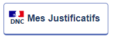
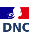

# Devenir partenaire du DNC
## 1.	URLs du DNC

 - URL de la plateforme de test : [https://dnc.apps.ocp-sbg1.dfp.ovh](https://dnc.apps.ocp-sbg1.dfp.ovh)
 - URL complète à intégrer (bouton ou lien) : [https://dnc.apps.ocp-sbg1.dfp.ovh/Redirect](https://dnc.apps.ocp-sbg1.dfp.ovh/Redirect)
 - URL de test des boutons : [https://dnc.apps.ocp-sbg1.dfp.ovh/test-button](https://dnc.apps.ocp-sbg1.dfp.ovh/test-button)

## 2.	En tant que fournisseur de service au citoyen

Dans le cadre d'une démarche ou d'un formulaire nécessitant des pièces justificatives du citoyen, sur votre formulaire, vous pouvez simplement ajouter un lien vers le DNC ou intégrer un des boutons DNC ci-dessous.

*En phase d'expérimentation, le lien mène à la plateforme de développement du DNC.*

L'équipe DNC met à disposition 3 types de boutons :

 - Un bouton **générique** : l’usager se connecte simplement au DNC
 - Un bouton de **présélection** d’une ou plusieurs attestations : l'usager arrive sur une liste présélectionnée d’attestations qu'il peut simplement télécharger. 
 - Un bouton **d’attestation personnalisée** : l'usager arrive sur une interface de génération d’attestation personnalisée pour un contexte prédéfini. Il peut ensuite simplement télécharger.
 

Peu importe le mode d'implémentation choisi, nous vous invitons à paramétrer l'URL du DNC afin de facilement mettre à jour votre plateforme.
### 2.1.	Bouton générique
Le bouton générique permet à l’usager de se connecter simplement au DNC.
Ci-dessous, le code HTML du bouton générique du DNC :

    

        Connectez vous avec FranceConnect pour accéder à vos justificatifs
        
             
            Mes Justificatifs 
        </button>
    

Le code complet du bouton générique est disponible ici : [https://github.com/betagouv/DNC/blob/master/docs/partenaires/bouton.html](https://github.com/betagouv/DNC/blob/master/docs/partenaires/bouton.html)

### 2.2.	Bouton de présélection d’une ou plusieurs attestations

Le bouton de présélection permet à l'usager d’arriver sur une liste de d’attestations présélectionnés qu'il peut simplement télécharger.

La différence entre le bouton de présélection et le bouton générique **est l'ajout du paramètre scope dans l'URL.** Celui-ci peut avoir différentes valeurs :

*a.	DECLARATION DES REVENUS*

**Paramètre scope :** DeclarationDesRevenus

**Utilisation :** permet de présélectionner les attestations liés à ses revenus et à sa déclaration aux impôts par exemple.

**Attestations téléchargeables :**  
o	Attestation de quotient familial
o	Attestation de revenus

**Code HTML :**

    

        Connectez-vous avec FranceConnect pour accéder à vos justificatifs liés à vos revenus
        
             
            Mes Justificatifs liés à mes revenus 
        </button>
    

*b.	NOUVELLE EMBAUCHE*

**Paramètre scope :** NouvelleEmbauche

**Utilisation :** permet de présélectionner les attestations nécessaires dans le cadre d’une nouvelle embauche par exemple.

**Attestations téléchargeables :**  
o	Informations personnelles FranceConnect
o	Attestation de droits

**Code HTML :**

    

        Connectez-vous avec FranceConnect pour accéder à vos justificatifs liés à votre nouvelle embauche
        
             
            Mes Justificatifs liés à ma nouvelle embauche 
        </button>
    

### 2.3.	Bouton d’attestation personnalisée

Le bouton de présélection permet à l'usager de générer une attestation personnalisée et spécifique en quelques clics.

La différence entre le bouton de présélection et le bouton générique est **l'ajout du paramètre scope dans l'URL**. Celui-ci peut avoir différentes valeurs :

*a.	IDENTITE FRANCECONNECT*

**Paramètre scope :** IDENTITE_FRANCECONNECT

**Utilisation :** permet par exemple d'obtenir une attestation de son identité numérique à partir de ses informations FranceConnect. 

**Données présentes dans l’attestation :**  
o	 Nom
o	Prénom(s)
o	Pays de Naissance
o	Ville de Naissance
o	Date de Naissance
o	Téléphone
o	Email
o	Nom d’usage
o	Sexe
o	Adresse

**Code HTML :**

    

        Connectez-vous avec FranceConnect pour accéder à vos justificatifs liés à mon identité FranceConnect
        
             
            Mes Justificatifs liés à mon identité FranceConnect 
        </button>
    

*b.	CARTE DE STATIONNEMENT*

**Paramètre scope :** CARTE_STATIONNEMENT

**Utilisation :** permet par exemple d'obtenir une attestation personnalisée pour une demande de carte de stationnement.

**Données présentes dans l’attestation :**  
o	 Nom
o	Prénom(s)
o	Adresse
o	Identifiant Véhicule(s)
o	Modèle(s) Véhicule(s)
o	Immatriculation(s) Véhicule(s)
o	Véhicule(s) électrique(s) : oui/non

**Code HTML :**

    

        Connectez-vous avec FranceConnect pour accéder à vos justificatifs liés à une demande de carte de stationnement
        
             
            Mes Justificatifs liés à ma demande de carte de stationnement 
        </button>
    

*c.	AUTORISATION DE STATIONNEMENT DANS LE CADRE D'UN DEMENAGEMENT*

**Paramètre scope :** AUTORISATION_STATIONNEMENT_DEMENAGEMENT

**Utilisation :** permet par exemple d'obtenir une attestation personnalisée dans le cadre d'une demande d'autorisation de stationnement pour un déménagement.  

**Données présentes dans l’attestation :**  
o	 Nom
o	Prénom(s)
o	Adresse

**Code HTML :**

    

        Connectez-vous avec FranceConnect pour accéder à vos justificatifs liés à une demande d’autorisation de stationnement dans le cadre d’un déménagement 
        
             
            Mes Justificatifs liés à ma demande d’une autorisation de stationnement dans le cadre d’un déménagement 
        </button>
    

*d.	INSCRIPTION EN CRECHE*

**Paramètre scope :** INSCRIPTION_CRECHE 
**Utilisation :** permet par exemple d'obtenir une attestation personnalisée pour une inscription d'un enfant, né ou à naitre, à la crèche.

**Données présentes dans l’attestation :**  
o	Nom du parent
o	Prénom(s) du parent
o	Adresse du parent
o	Nom de l’enfant
o	Prénom de l’enfant
o	Date de naissance de l’enfant (ou à naître si non renvoyé par la CAF)
o	Adresse de l’enfant
o	Revenu fiscal de référence

**Code HTML :**

    

        Connectez-vous avec FranceConnect pour accéder à vos justificatifs liés à une demande d’inscription en crèche 
        
             
            Mes Justificatifs liés à ma demande d’inscription en crèche </ 
        </button>
    

*e.	INSCRIPTION A L'ECOLE*

**Paramètre scope :** INSCRIPTION_ECOLE 

**Utilisation :** permet par exemple d'obtenir une attestation personnalisée pour l’inscription d'un enfant à l'école.

**Données présentes dans l’attestation :**  
o	Nom du parent
o	Prénom(s) du parent
o	Adresse du parent
o	Nom de l’enfant
o	Prénom de l’enfant
o	Adresse de l’enfant
o	Revenu fiscal de référence

**Code HTML :**

    

        Connectez-vous avec FranceConnect pour accéder à vos justificatifs liés à une demande d’inscription à l’école
        
             
            Mes Justificatifs liés à ma demande d’inscription à l’école</ 
        </button>
    

*f.	DEMANDE DE TRANSPORT SCOLAIRE*

**Paramètre scope :** DEMANDE_TRANSPORT_SCOLAIRE 

**Utilisation :** permet par exemple d'obtenir une attestation personnalisée pour une demande d'inscription au transport scolaire.

**Données présentes dans l’attestation :**  
o	Nom de l’enfant
o	Prénom de l’enfant
o	Adresse de l’enfant
o	Revenu fiscal de référence

**Code HTML :**

    

        Connectez-vous avec FranceConnect pour accéder à vos justificatifs liés à une demande de transport scolaire
        
             
            Mes Justificatifs liés à ma demande de transport scolaire</ 
        </button>
    

*g.	DEMANDE D'INSCRIPTION A LA RESTAURATION SCOLAIRE*

**Paramètre scope :** RESTAURATION_SCOLAIRE

**Utilisation :** permet par exemple d'obtenir une attestation personnalisée pour une demande d'inscription à la restauration scolaire.

**Données présentes dans l’attestation :**  
o	Nom du parent
o	Prénom(s) du parent
o	Adresse du parent
o	Nom de l’enfant
o	Prénom de l’enfant
o	Adresse de l’enfant
o	Revenu fiscal de référence

**Code HTML :**

    

        Connectez-vous avec FranceConnect pour accéder à vos justificatifs liés à une demande d’inscription à la restauration scolaire
        
             
            Mes Justificatifs liés à ma demande d’inscription à la restauration scolaire</ 
        </button>
    

## 3.	Archive et exemples

Si vous souhaitez implémenter un bouton, vous pouvez consulter le zip contenant le code HTML (incluant le style) et l'image du bouton :
[Zip du bouton](boutonDNC.zip).

Un exemple d'affichage est le suivant :

